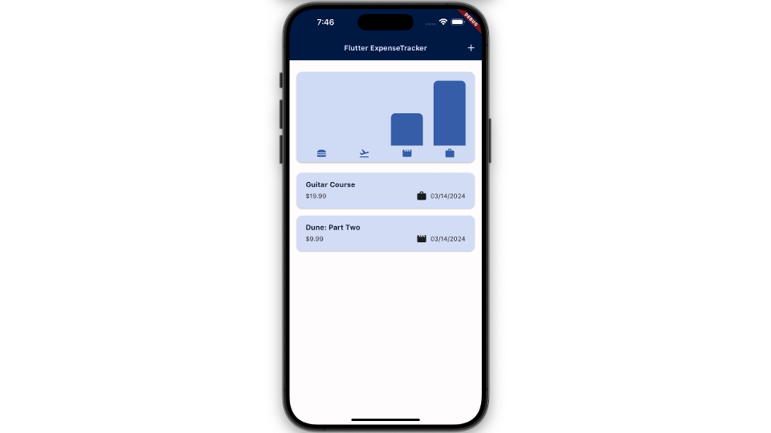
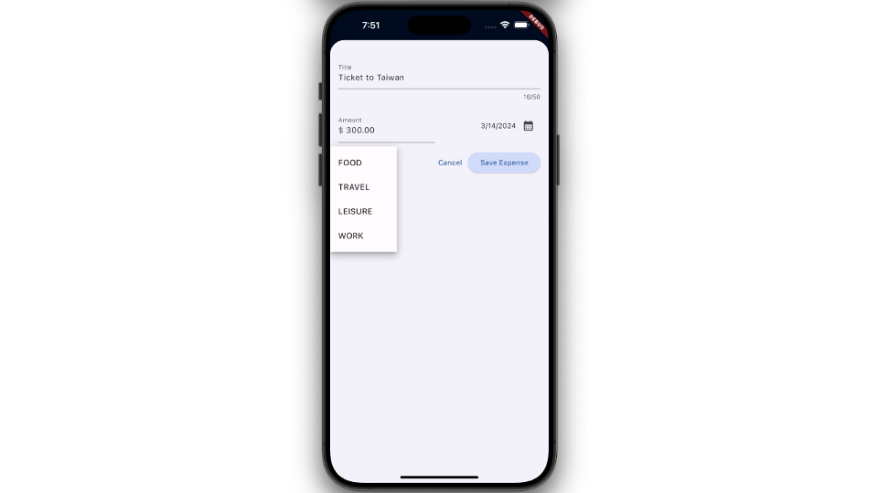
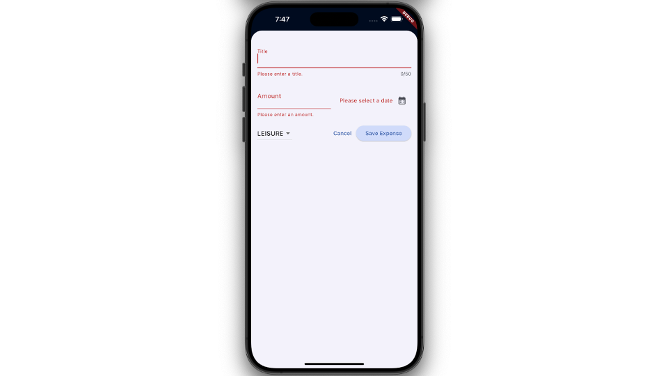
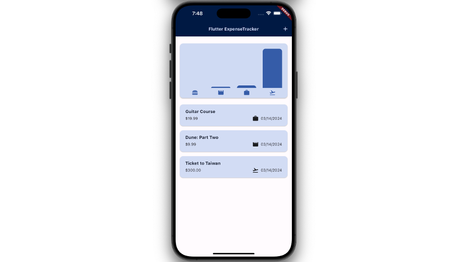
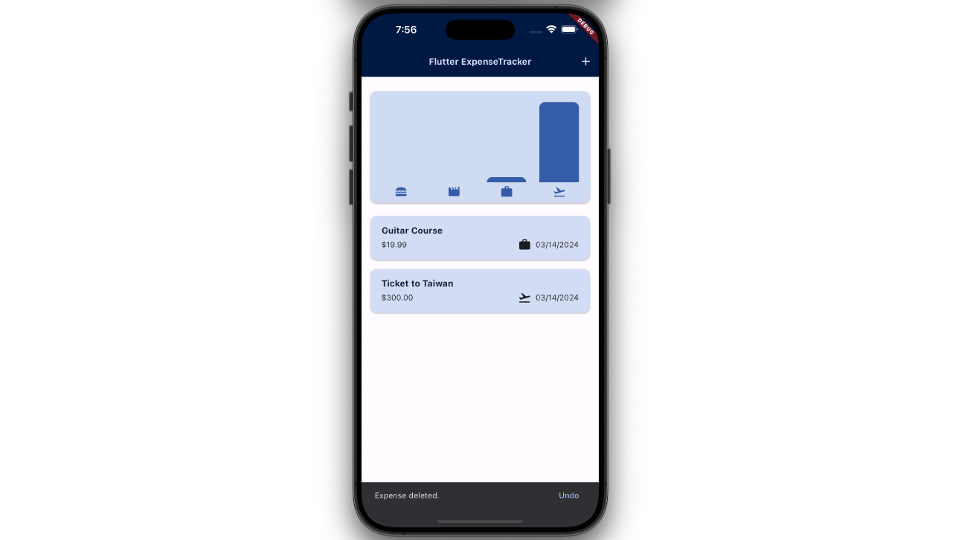
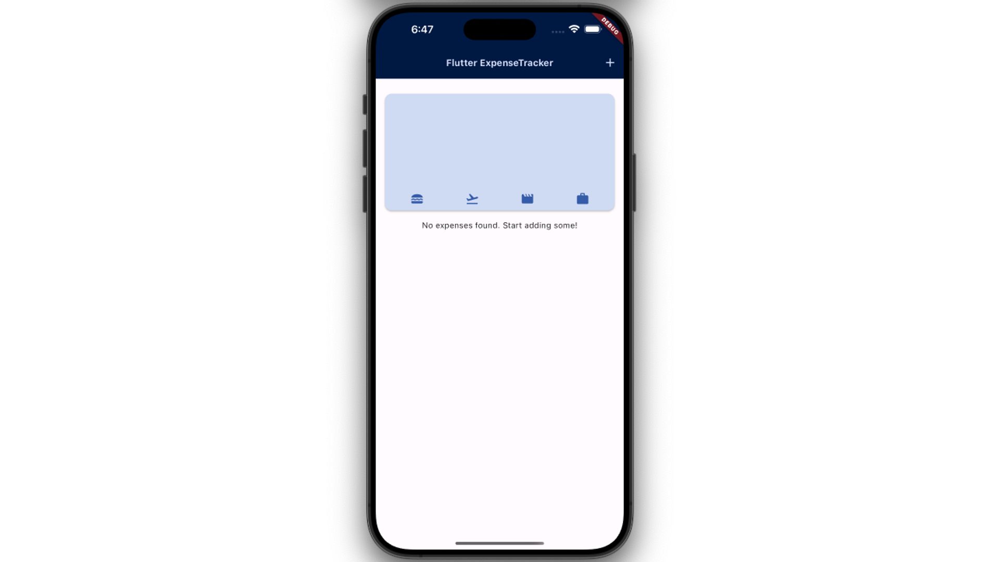
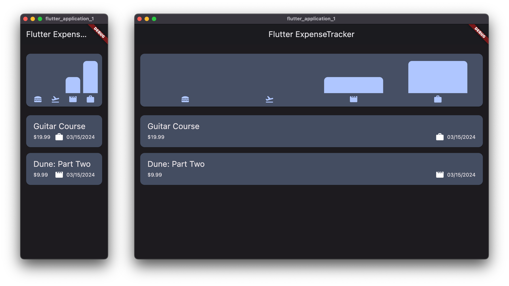
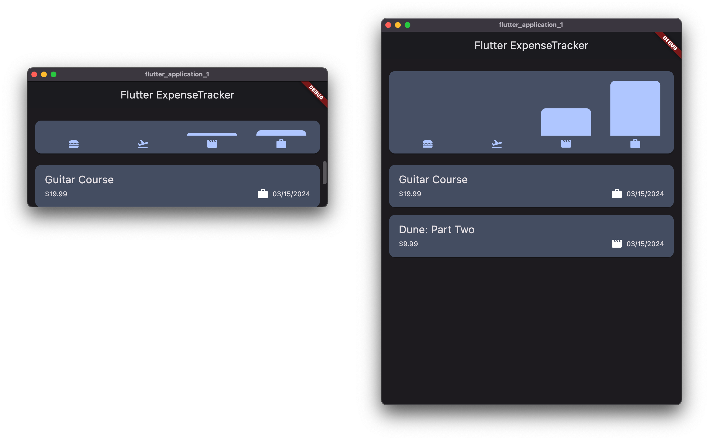

# Expense Tracker App

In this project, using Flutter and Dart to develop an expense tracker app. Users can add expenses by inputting the title, amount, date, and category and delete expenses. Additionally, the app will display a chart showing the proportion of each category’s total amount in increasing order.

There is an advanced version: 

- [Expense Tracker App with Parallax Scrolling](https://github.com/rogerchang1108/Expense-Tracker-App-with-Parallax-Scrolling-with-Flutter). 

Check it out now.

## Features

1. After entering values from the form, the **Chart** will display the difference in bar heights between each category, reflecting the proportion of each item's **Total Amount**.

   

2. The implement the form: Input **Title**, **Amount** and choose the **Date**, **Category**.

   

3. The **Warning** will show after pushing "Save" button if invalid input detected.
    
    

4. The chart also reflects the proportion of each item's total amount in **Increasing Order**.

   

5. Swipe to delete the expense. A snack bar appears, allowing undo the deletion by pressing the button on it.

    

6. When there is no expenses found, a Hint will show.

    

7. In window view, the chart’s size changes in order to fit the window when user re-size it.

    

    

## Resources

A few introductory tutorials:

- [Chart bar implementation](https://api.flutter.dev/flutter/widgets/FractionallySizedBox-class.html)
- [Form](https://dev.to/aspiiire/easy-way-to-write-forms-in-flutter-37ni)
- [Material Theme Builder](https://m3.material.io/theme-builder#/custom)
